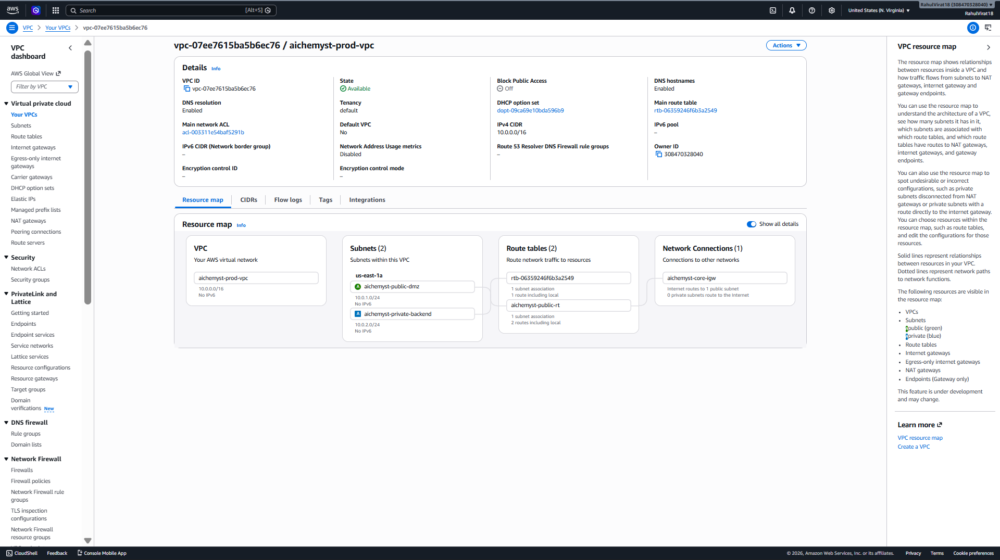
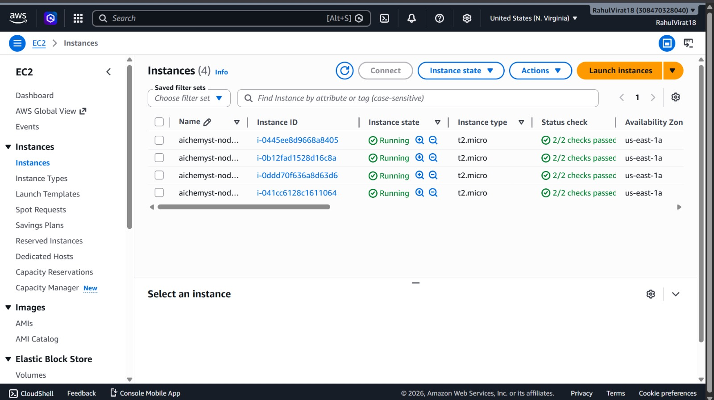

# Air-Gapped Distributed Runtime Orchestration Grid

A production-grade cloud infrastructure architecture built on AWS using Terraform. This project demonstrates a highly secure, multi-tier Network Topology designed to isolate distributed computational runtimes (Python & TypeScript) within an air-gapped environment while maintaining zero public ingress/egress boundaries on the database and execution layers.

---

## 🏗️ Architectural Overview

The core system design segments public traffic orchestration away from runtime computing threads through strict AWS Security Group policies, explicit route table constraints, and private cryptographic interconnects.

### 📍 Core Network Infrastructure Map


### 🛡️ Network Multi-Tier Topography
* **Public DMZ Management Tier (Subnet: `10.0.1.0/24`):** Hosts the perimeter Gateway Controller Instance. This node acts as the single administrative entry point for orchestration deployment, telemetry collation, and secure proxying.
* **Isolated Computing Tier (Subnet: `10.0.2.0/24`):** A strictly air-gapped cluster network segment housing execution nodes with zero direct Internet Gateway or NAT attachment points. Runtimes communicate securely over private RPC lines.

---

## 💻 Cluster Nodes Allocation

### 📍 EC2 Compute Infrastructure Fabric


| Node | Interface IP | Runtime Stack | Operational Layer Role |
| :--- | :--- | :--- | :--- |
| **VM 1** | `10.0.1.202` (Public) | Bash / SSH Mesh | Control Gateway / Routing Proxy |
| **VM 2** | `10.0.2.4` (Isolated) | Bun / Node.js Engine | TypeScript API Pipeline Coordinator |
| **VM 3** | `10.0.2.169` (Isolated) | Python 3 Engine | High-Performance Inference Worker |

---

## ⚙️ Process & Lifecycle Management

Both backend cluster instances run decentralized, isolated service frameworks managed natively via system-level process supervisors. This guarantees high availability, automated crash recoveries, and runtime decoupling without external dependency overhead.

### 1. TypeScript Worker Configuration (`caller-worker.service`)
Managed as an isolated background daemon utilizing native systemd resource mappings:

```ini
[Unit]
Description=AiChemyst Caller Worker Service (TypeScript)
After=network.target

[Service]
Type=simple
User=ubuntu
WorkingDirectory=/home/ubuntu/caller-worker
Environment=PATH=/home/ubuntu/.bun:/home/ubuntu/node/bin:/usr/local/bin:/usr/bin:/bin
ExecStart=/home/ubuntu/.bun/bun run src/index.ts
Restart=on-failure

[Install]
WantedBy=multi-user.target
```

### 2. Python Inference Worker Configuration (inference-worker.service)
Monitored by the kernel process manager to enforce strict execution loop memory handling boundaries:

```ini
[Unit]
Description=AiChemyst Inference Worker Service (Python)
After=network.target

[Service]
Type=simple
User=ubuntu
WorkingDirectory=/home/ubuntu/inference-worker
Environment=PATH=/usr/bin:/bin
ExecStart=/usr/bin/python3 inference_worker.py
Restart=on-failure

[Install]
WantedBy=multi-user.target
```

---

## 🛠️ Infrastructure Provisioning Sequence

The environment footprint is completely declaratively reproducible via Terraform. Follow these instructions to deploy the entire grid from a clean cloud shell layout:

### 1. Initialize Global Providers
```bash
terraform init
```

### 2. Validate Resource Graphs
```bash
terraform validate
```

### 3. Review Plan Execution Output
```bash
terraform plan
```

### 4. Deploy Infrastructure Graph Natively
```bash
terraform apply -auto-approve
```

---

## 🔐 Security Hardening & Isolation Mechanics

Because the infrastructure intentionally enforces true zero-egress isolation on the backend tier, standard interactive package manager installs were natively restricted to preserve network integrity.

- **Network Hygiene:** Workers possess no external public mappings, completely mitigating brute-force edge layer risks.
- **Access Security:** Key-based cross-node communication is limited to internal SSH key fabrics forwarded over local proxy paths.
